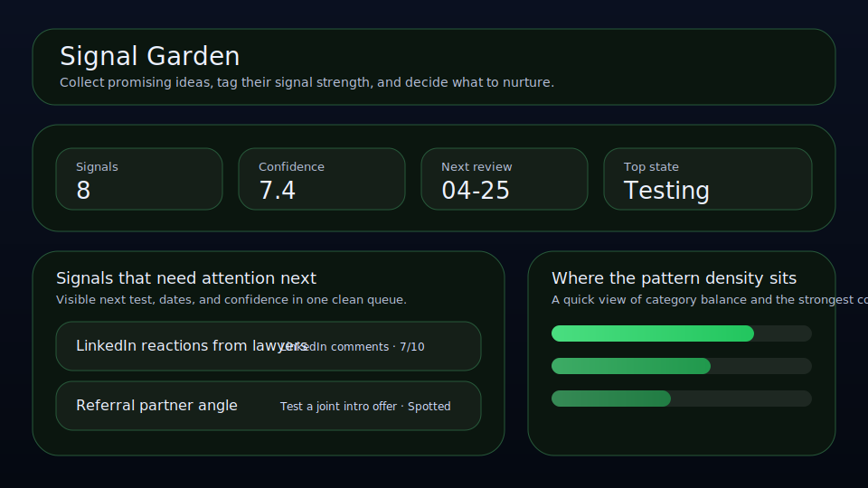

# Signal Garden

Collect promising ideas, tag their signal strength, and decide what to nurture.



Signal Garden is a local-first workspace for founders, operators, and solo builders who want a cleaner way to manage signals. It keeps confidence, source, next test, and review timing visible so the right things move forward with less drift.

## What it does

- ranks signals by leverage, confidence, timing, and friction
- tracks **source**, **next test**, **review date**, and **confidence** for each signal
- highlights the best current bet, the next review slot, and the strongest signal on the board
- renders a dedicated queue plus a category mix snapshot beneath the main board
- saves locally in the browser with JSON import/export backups
- quick action: **Schedule next test**
- quick action: **Nurture signal**
- quick action: **Copy next test**

## Why it feels different

Signal Garden is not just a generic list. It is shaped around the real workflow behind signals, so the board helps you decide what matters next instead of simply storing records.

## Quick start

```bash
git clone https://github.com/get2salam/signal-garden.git
cd signal-garden
python -m http.server 8000
```

Then open <http://localhost:8000>.

## Keyboard shortcuts

- `N` creates a new signal
- `/` focuses and selects the search box
- `Esc` clears the active search filter

## Privacy

Everything stays in your browser unless you export a JSON backup.

## Verification

Signal Garden ships with an offline board audit that runs without a browser. It
re-parses the SPEC out of `js/main.js`, checks the invariants the UI silently
depends on (states ⊇ completedStates, `stateWeights` covers every state,
actions and seed items reference only declared categories/states, metric bounds
are sane), and prints a deterministic priority ranking for the seed items.

```bash
node tools/audit-board.mjs        # one-shot audit + ranked seed board
node --test tools/*.test.mjs      # full audit test suite
```

The same two commands run in CI via `.github/workflows/audit.yml`.

## Customizing your board

The `SPEC` object in `js/main.js` drives every label, category, and state on
the board. The most common customization — adding a new state, say
`Archived` for shelved signals — has one sharp edge: if you add the state
without also adding a `stateWeights` entry (and a `completedStates` entry, if
it should count as done), nothing throws. The board just renders fine and
silently scores that state as 0 priority forever.

`tools/customize-board.example.mjs` walks through exactly this mistake and
the fix, using the same `validateSpec` the audit runs:

```bash
node tools/customize-board.example.mjs
```

```
Adding an "Archived" state without wiring it up...
  caught: stateWeights is missing an entry for state "Archived"

Wiring up stateWeights + completedStates for "Archived"...
  OK — customization is safe to ship.
```

A guard test (`tools/customize-board.example.test.mjs`, covered by the
`node --test tools/*.test.mjs` command above) pins this behavior so it stays
true as the audit evolves.

## License

MIT
